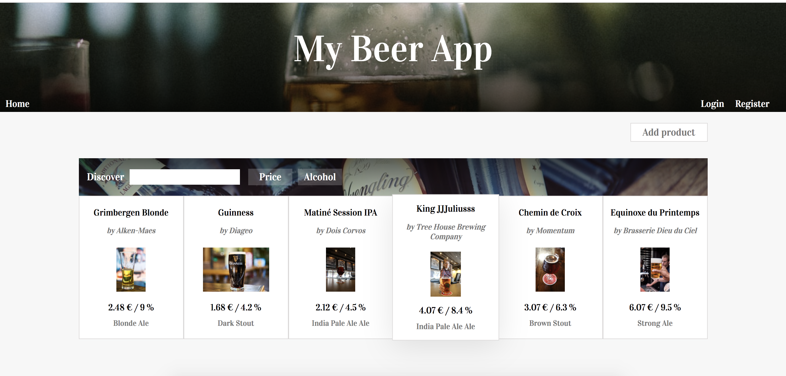

# impact-code-challenge
A Wine / Beer cellar web app built in React JS as a code challenge for Impact. Includes a full NodeJS / GraphQL / Typescript companion api.

# demo
(app not live yet, here's a vimeo link for now)
https://vimeo.com/358508529

# instructions
1. Install any dependencies with `npm install` on both back-end and front-end projects
2. Run `npm run dev`to concurrently lift the json server, the back end api and the client application

